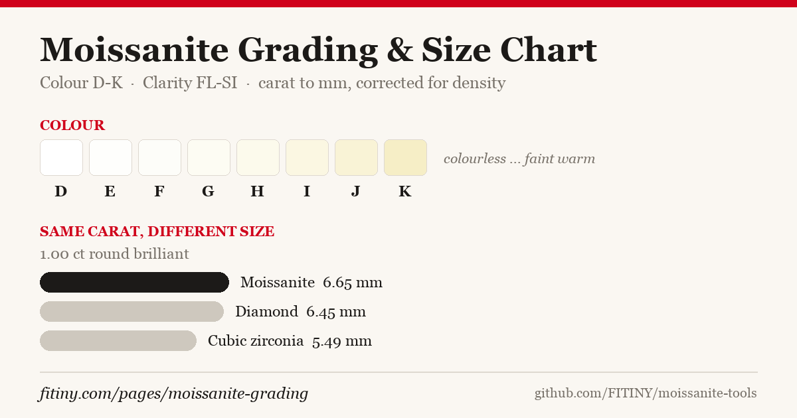

# moissanite-tools



Grading reference and carat↔millimetre conversion for **moissanite** — calculated, not copied.

## Why this exists

Practically every carat/mm chart on the web is calculated for **diamond**. Moissanite has a
different density (3.21 vs 3.52 g/cm³), so applying a diamond chart to moissanite is wrong by
roughly 9%:

| Diameter | Diamond | Moissanite | Cubic zirconia |
|---:|---:|---:|---:|
| 4.0 mm | 0.24 ct | 0.22 ct | 0.39 ct |
| 5.0 mm | 0.47 ct | 0.43 ct | 0.76 ct |
| 6.5 mm | 1.03 ct | 0.94 ct | 1.66 ct |
| 8.0 mm | 1.91 ct | 1.74 ct | 3.09 ct |

This is why moissanite is usually sold by millimetre rather than by carat — the same "1 carat"
looks like a different size depending on the stone.

## What's in here

```
data/grading.json    GIA colour (D–K) and clarity (FL–SI) scales, plus published
                     optical constants for moissanite / diamond / cubic zirconia
src/conversion.js    carat ↔ mm for round brilliant cut, density-corrected
mcp/server.js        Model Context Protocol server so an AI agent can query the above
```

## Usage

```js
import { caratFromMm, mmFromCarat, compareAtWeight } from './src/conversion.js';

mmFromCarat(1, 'moissanite');   // 6.65 mm
mmFromCarat(1, 'diamond');      // 6.45 mm
caratFromMm(6.5, 'moissanite'); // 0.94 ct

compareAtWeight(1);
// { carat: 1, moissanite_mm: 6.65, diamond_mm: 6.45, cz_mm: 5.49 }
```

### MCP server

```bash
node mcp/server.js
```

Exposes three tools: `carat_to_mm`, `mm_to_carat`, `grading_scale`.

## The maths

GIA's round-brilliant formula, scaled by relative density:

```
weight_ct = diameter_mm² × depth_mm × 0.0061 × (ρ_stone / ρ_diamond)
depth_mm  = diameter_mm × 0.612        (average depth ratio, well-cut round)
```

Accuracy against published diamond charts: **1.4% mean, 3.3% max**. Real stones vary with cut
proportions — treat the output as guidance, not as a substitute for weighing a stone.

**Round brilliant only.** Fancy shapes (oval, princess, emerald, pear) distribute weight
differently and need shape-specific factors that aren't in here.

## On the data

Colour and clarity scales follow the GIA diamond grading system, which the moissanite trade has
adopted. The optical constants (refractive index, dispersion, Mohs hardness, density) are
published gemmological values. **Nothing here was scraped from another site** — the conversion
figures are computed from the formula above, which is why they can be released under MIT.

This is a descriptive reference, not a certification. A graded stone comes with a report from a
gemmological laboratory; this repo just explains what those grades mean.

## Live tool

An interactive version runs at
[fitiny.com/pages/moissanite-grading](https://fitiny.com/pages/moissanite-grading).

## Licence

MIT — see [LICENSE](LICENSE). Maintained by [FITINY Jewelry](https://fitiny.com).
